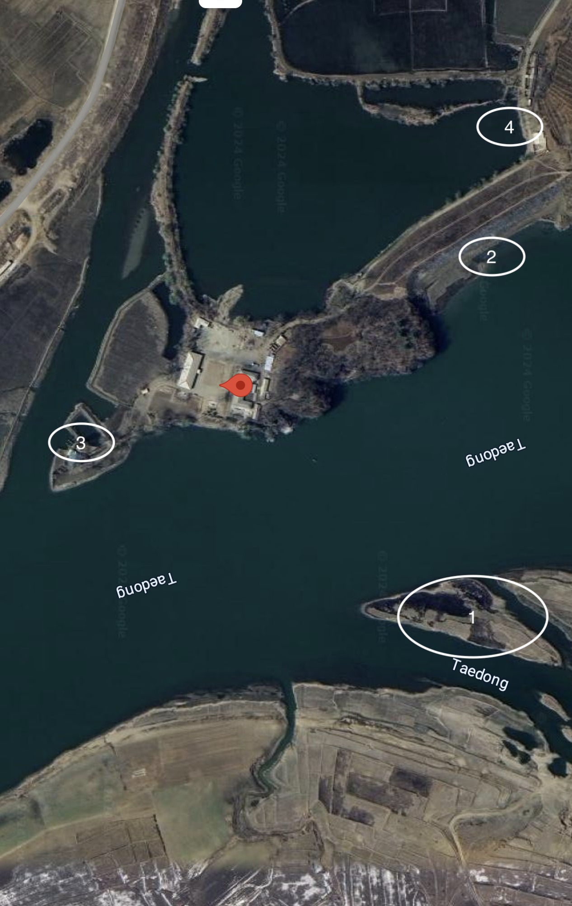
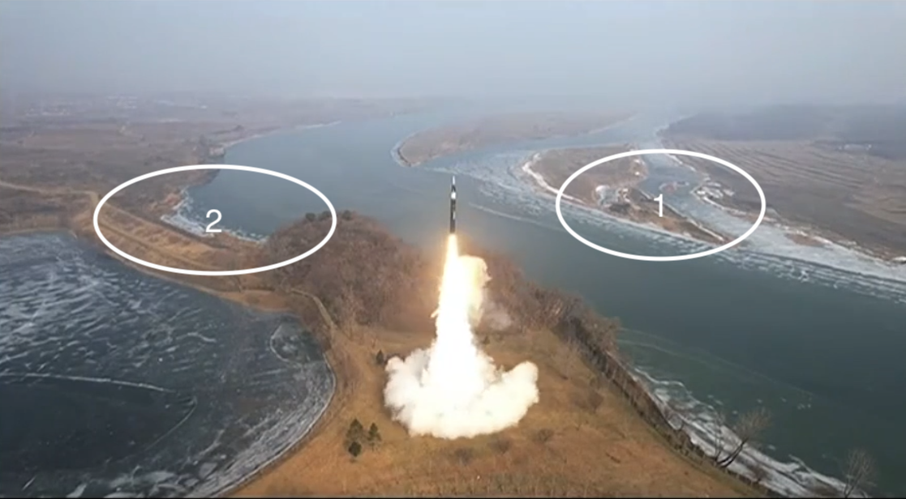
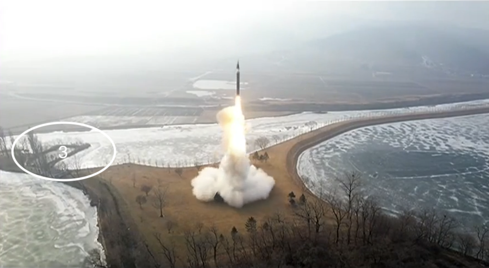
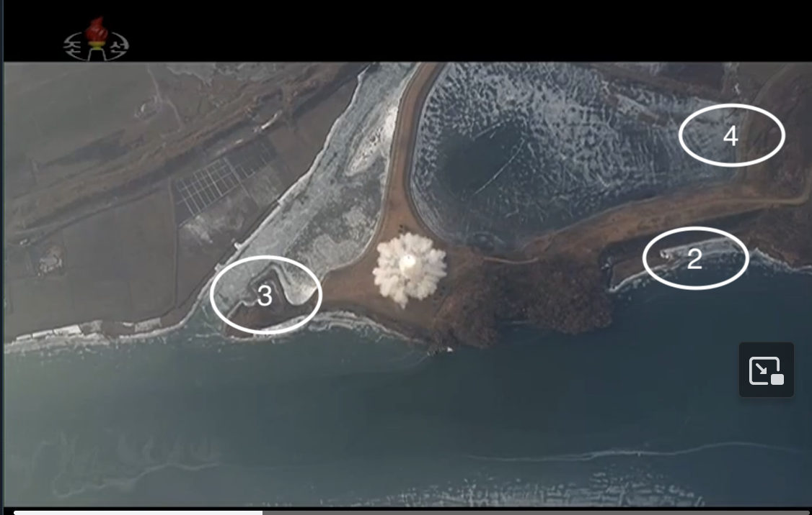
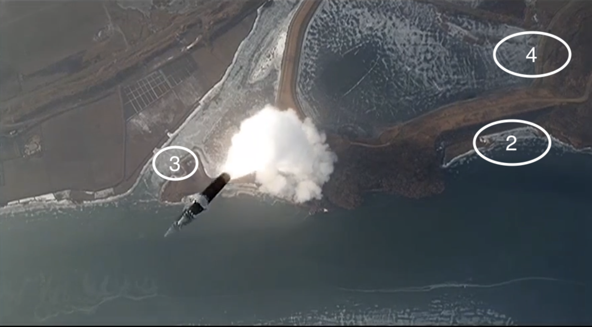
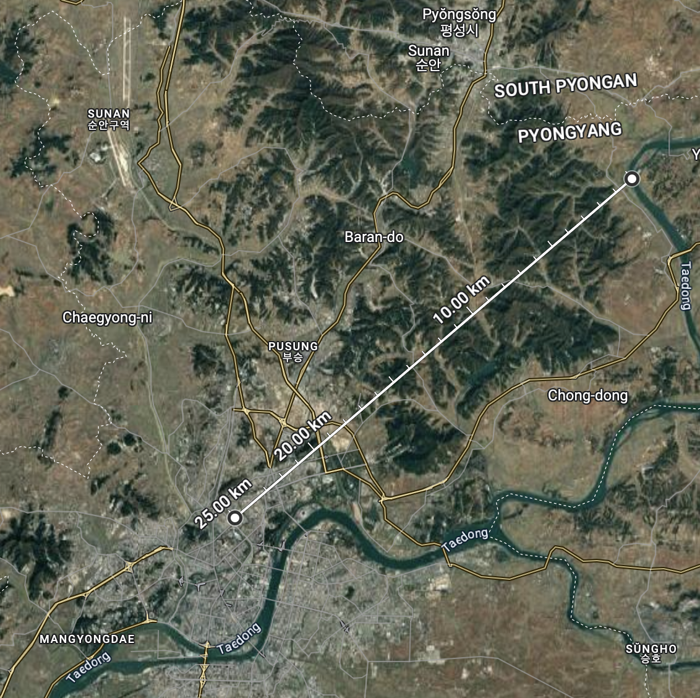

# 20250106 DPRK IRBM Launch Site

_And this one time, on the internet, I found a missle launch site, by accident..._

On 6 January 2025 the [DPRK](https://en.wikipedia.org/wiki/North_Korea) test fired an intermediate-range ballistic missile (IRBM) and provided a georgous video set to ominous music of the launch (via [@martynw.bsky.social](https://bsky.app/profile/martynw.bsky.social/post/3lf4ojgjahc2j)). 

<video width="600" controls>
  <source src="https://raw.githubusercontent.com/gr0k3/dprk-irbm-20250106/main/launch.mp4" type="video/mp4">
  Your browser does not support the video tag.
</video>

# Where is the launch site?
Aljazera reports the hypersonic missile was fired from the [outskirts of Pyongyang](https://www.aljazeera.com/news/2025/1/7/north-korea-says-test-of-new-hypersonic-missile-successful) and those georgous videos got me wondering if I could find the launch site. I started by looking for rivers around [Pyongyang](https://en.wikipedia.org/wiki/Pyongyang) with features similar to those on the video and got lucky with [this site](https://maps.app.goo.gl/BT1pjZ7qVvSRSTdPA) on the [Taedong River](https://en.wikipedia.org/wiki/Taedong_River) (the map oriented so north is up and numbers are identified on stills from the launch video below).

For convenience I'm calling the site "Blinken-Taedon" in reference to the suggestion from Aljazera that the launch had something to do with a visit to South Korea by US Secretary of State Antony Blinken. 

Here are some stills from video marked up with matching features from the [Google Maps](https://maps.app.goo.gl/BT1pjZ7qVvSRSTdPA) site. A few differences between the Google and launch video stills:
- The seasons are different - its warmer in Google's image than the launch video, which means more ice in the river.
- Structures have been demolished around the launch pad - likely to be to ease access to the pad area for large trucks.

 

 

 

 

There are enough similarities between the site that I'm confident they're the same, but there are some reasons to doubt:
1. I have no skills/qualifications in geolocation or knowledge of DPRK and its missle launches, just an enthusiastic amateur. 
2. "Blinken-Taedon" is amazingly close to Pyongyang (<25km according to Google Maps)

